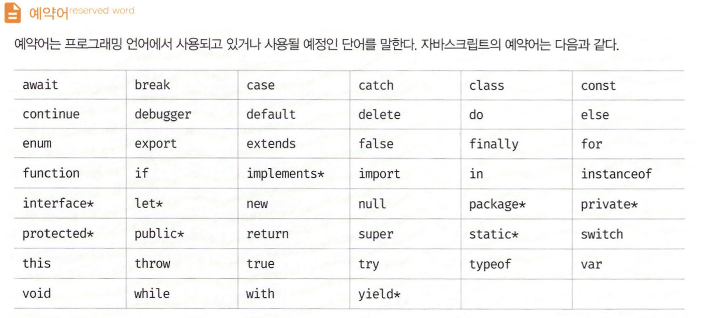
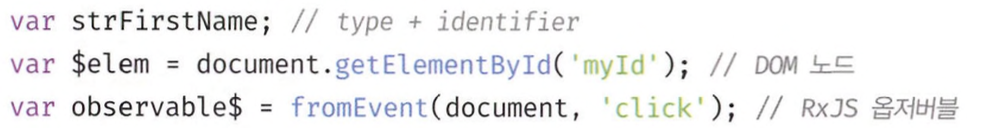
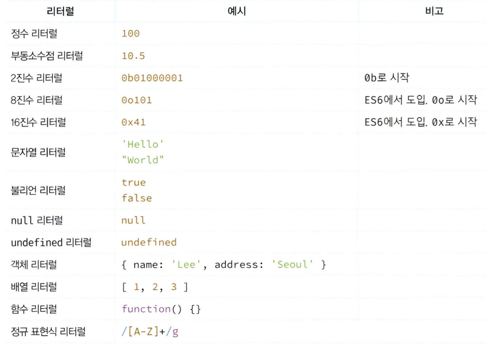
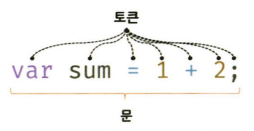

# 4장 변수

## 변수

자바스크립트는 개발자의 직접적인 메모리 제어를 허용하지 않기 때문에 하나의 값을 저장하기 위해 확보한 메모리 공간 자체 또는 그 메모리 공간을 식별하기 위해 붙인 이름인 `변수`를 이용한다.

→ 값의 위치를 가리키는 상징적인 이름, 개발자가 직접 메모리 주소를 통해 값을 저장하고 참조할 필요가 없고 변수를 통해 안전하게 값에 접근 가능

*할당: 변수에 값을 저장하는 것
*참조: 변수에 저장된 값을 읽어 들이는 것

## 식별자

어떤 값을 구별해서 식별할 수 있는 고유한 이름, 값이 아니라 메모리 주소를 기억

## 변수 선언

### var / let / const 키워드

<aside>
💡

var

var는 블록레벨스코드 대신 함수레벨스코프를 지원하기 때문에 의도치 않게 전역 변수가 선언되어 심각한 부작용이 발생하기도 함

이를 보완하기 위해 ES6에서 let 과 const를 도입했음

</aside>

### var

- 변수를 선언하고 변수에 값을 할당하지 않으면 자바스크립트 엔진에 의해 `undefined`라는 값이 암묵적으로 할당되어 초기화 됨
- 자바스크립트 엔진은 변수 선언을 **2단계 - 선언단계(변수이름등록), 초기화 단계(메모리공간확보, undefined 할당)**에 거쳐 수행
- 변수 이름을 비롯한 모든 식별자는 실행 컨텍스트에 등록
- 초기화를 거치지 않으면 이전에 사용했던 값이 남아 쓰레기값이 나올수 있는데 var는 undefined로 이를 방지함

## 변수 선언의 실행 시점과 변수 호이스팅

```javascript
console.log(score);
var score;
```

- 참조에러(ReferenceError)가 발생할 것 처럼 보이지만 발생하지 않고 undefined가 출력됨
- 자바스크립트 엔진은 소스코드 실행을 위한 준비단계인 소스코드 평가과정에서 변수선언을 포함한 모든 선언문을 소스코드에서 찾아 먼저 실행함
- **변수 선언문이 코드의 선두로 끌어 올려진 것처럼 동작하는 자바스크립트 고유의 특징
  (**변수뿐 아니라 키워드를 사용해서 선언하는 모든 식별자는 호이스팅됨**)
  → 변수 호이스팅**

## 값의 재할당

재할당 된 변수의 이전값들은 가비지 콜렉터에 의해 메모리에서 자동 해제 됨 \*가비지콜렉터
애플리케이션이 할당한 메모리 공간을 주기적으로 검사하여 더 이상 사용되지 않는 메모리를 해제하는 기능 → 메모리 누수 방지

## 식별자 네이밍 규칙

- 특수문자를 제외한 문자, 언더스코어, 달러 기호 포함 가능
- 숫자로 시작되는것은 허용되지 않음
- 예약어는 식별자로 사용될 수 없음
  
- 자바스크립트는 대소문자도 구별
- 네이밍 컨벤션
  - 카멜케이스 camelCase
  - 스네이크 케이스 snake_case
  - 파스칼 케이스 PascalCase
  - 헝가리언 케이스 typeHungarianCase
    

# 5장 표현식과 문

## 값

- 식이 평가되어 생성된 결과
- 값은 리터럴을 사용해 생성할 수 있음

## 리터럴

사람이 이해할 수 있는 문자 또는 약속된 기호를 사용해 값을 생성하는 표기법



## 표현식

```javascript
const assignedVariable = 2; //문장(Statement)

assignedVariable * 4; // 표현식(Expression)

assignedVariable * 10; // 표현식(Expression)

assignedVariable - 10; // 표현식(Expression)

100; // 표현식(Expression)

50 + 50; // 표현식(Expression)

assignedVariable; // 표현식(Expression)

square(); // 표현식(Expression) 함수 호출도 표현식
```

- 표현식은 값을 만들어 냄
- 반드시 상태를 바꿀 필요는 없음
- 리터럴도 표현식이라 할 수 있음

## 문

### 문

프로그램을 구성하는 기본 단위이자 최소 실행 단위

### 토큰

문법적인 의미를 가지며, 문법적으로 더 이상 나눌 수 없는 코드의 기본요소



```javascript
var x; // 표현식인 문
x = 1 + 2; // 표현식이 아닌 문

// 변수에 값을 할당했을때 가능하면 표현식인 문, 아니면 표현식이 아닌 문

x = 100; //할당문은 표현식인 문임
```

\*완료값
표현식이 아닌 문을 실행하면 undefined를 출력함 → 완료값
표현식인 문을 실행하면 평가된 값을 반환함

# 06 데이터 타입

- data type : 값의 종류를 말하며, JS 의 모든 값은 데이터 타입을 가짐
- ES6 에서는 7개의 타입을 제공
- 7개의 타입은 원시 타입(primitive type) 과 객체 타입 (object / reference type)으로 분류

|   구분    | 데이터 타입 | 설명                                                  |
| :-------: | :---------: | :---------------------------------------------------- |
| 원시 타입 |   number    | 숫자, 정수와 실수 구분 없이 하나의 숫자 타입으로 존재 |
| 원시 타입 |   string    | 문자열                                                |
| 원시 타입 |   boolean   | 논리적 true / false                                   |
| 원시 타입 |  undefined  | var 키워드로 선언된 변수에 암묵적으로 할당되는 값     |
| 원시 타입 |    null     | 값이 없다는 것을 의도적으로 명시할 때 사용하는 값     |
| 객체 타입 |             | 객체, 함수, 배열 등                                   |

## 6.1 number

- C 나 Java 의 경우에는 정수, 실수를 구분해서 int, long, float, double 등 다양한 숫자 타입이 있지만, JS 는 하나의 숫자 타입만 존재

```javascript
var integer = 10; // 정수
var double = 10.12; // 실수
var negative = -20; // 음의 정수
```

```javascript
var binary = 0b01000001; // 2 진수
var octal = 0o101; // 8진수
var hex = 0x41; // 16진수

// 표기법만 다를 뿐 모두 같은 값
console.log(binary, octal, hex); // 65, 65, 65
console.log(binary === octal); // true
console.log(octal === hex); // true
```

- JS의 number 타입은 정수만을 위한 타입이 없고 모든 수를 실수로 처리
- 표기는 정수로 표기되나 사실은 실수라는 것을 의미

```javascript
console.log(1 === 1.0); // true
console.log(4 / 2); // 2
console.log(3 / 2); // 1.5
```

- 숫자 타입은 추가적으로 세 가지 특별한 값도 표현 가능
  - infinity : 양의 무한대
  - -infinity : 음의 무한대
  - NaN : 산술 연산 불가 (not-a-number)

```javascript
console.log(10 / 0); // infinity
console.log(10 / -0); // -infinity
console.log(1 * "String"); // NaN
```

## 6.2 String

- text data를 나타내는 데 사용
- 문자열은 작은 따옴표, 큰 따옴표, 백틱으로 text 감싸기
- 가장 일반적인 표기법은 작은 따옴표 사용

```javascript
var string;
string = "문자열"; // 작은 따옴표
string = "문자열"; // 큰 따옴표
string = `문자열`; // 백틱(ES6)
```

```javascript
var string = hello; // ReferenceError : hello is not defined
```

## 6.3 템플릿 리터럴

- ES6 부터 템플릿 리터럴이라고 하는 새로운 문자열 표기법 도입
- 멀티라인 문자열, 표현식 삽입, 태그드 탬플릿 등 편리한 문자열 처리 기능을 제공
- 백틱 (``)을 사용해 표현

```javascript
var template = `Template literal`;
console.log(template); // Template literal
```

### 6.3.1. 멀티라인 문자열

```javascript
var str = `Hello
world.`;
// SyntaxError : Invalid or unexpected token
```

- 일반 문자열 내에서 줄바꿈 등의 공백을 표현하려면 백슬래시로 시작하는 이스케이프 시퀀스를 사용해야함

```javascript
var template = `<ul>\n\t<li><a href="#">Home</a></li>\n</ul>`;
console.log(template);
```

```
<ul>
  <li><a href="#">Home</a></li>
</ul>
```

- 일반 문자열과 달리 템플릿 리터럴 내에서는 이스케이프 시퀀스를 사용하지 않고도 줄바꿈이 허용되며 모든 공백도 있는 그대로 적용

```javascript
var template = `<ul>
  <li><a href="#">Home</a></li>
</ul>`;

console.log(template);
```

```
<ul>
  <li><a href="#">Home</a></li>
</ul>
```

### 6.3.2. 표현식 삽입

- 문자열은 문자열 연산자 + 를 사용해 연결 가능
- `+` 연산자는 피연산자 중 하나 이상이 문자열인 경우 문자열 연결 연산자로 동작

```javascript
var first = `Ung-mo`;
var last = `Lee`;

console.log(`My name is` + first + ` ` + last + `.`);
// My name is Ung-mo Lee.
```

- 템플릿 리터럴 내에서 표현식 삽입을 통한 문자열 삽입
  - 표현식 삽입하기 위해서는 `${}` 으로 표현식 감싸기
  - 표현식의 평가 결과가 문자열이 아니더라도 문자열로 타입이 강제로 변환되어 삽입

```javascript
var first = `Ung-mo`;
var last = `Lee`;
console.log(`My name is ${first} ${last}.`);
```

- 표현식 삽입은 반드시 템플릿 리터럴 내에서 사용해야 함

```javascript
console.log(`1 + 2 = ${1 + 2}`); // 1 + 2 = 3
```

```javascript
console.log("1 + 2 = ${1 + 2}"); // 1 + 2 = ${1 + 2}
```

## 6.4 불리언 타입

- 불리언 타입의 값은 논리적 참, 거짓을 나타내는 true, false
- 참과 거짓으로 구분되는 조건에 의해 프로그램의 흐름을 제어하는 조건문에서 자주 사용

```javascript
var foo = true;
console.log(foo); // true

foo = false;
console.log(foo); // false
```

## 6.5 undefined 타입

```javascript
var foo;
console.log(foo); // undefined
```

- 개발자가 의도적으로 할당하기 위한 값이 아니라 JS 엔진이 변수를 초기화할 때 사용하는 값
- 변수를 참조했을 때, undefined 가 반환된다면 참조한 변수가 선언 이후 값이 할당된 적이 없는, 초기화되지 않은 변수라는 것을 간파할 수 있음
- 변수에 값이 없다는 것을 명시하고 싶을 때에는 null 할당

## 6.6 null 타입

- null 은 변수에 값이 없다는 것을 의도적으로 명시할 때 사용
- 변수에 null을 할당하는 것은 변수가 이전에 참조하던 값을 더 이상 참조하지 않겠다는 의미

```javascript
var foo = "Lee";

// 이전 참조를 제거, foo 변수는 더 이상 'Lee' 를 참조하지 않음
// 유용해 보이지는 않음
// 변수의 scope 를 좁게 만들어 변수 자체를 재빨리 소멸시키는 편이 나음
foo = null;
```

## 6.7 심벌 타입

- 변경 불가능한 원시 타입의 값

```javascript
// 심벌 값 생성
var key = Symbol("key");
console.log(typeof key); // symbol

// 객체 생성
var obj = {};

// 이름이 충돌할 위험이 없는 유일무이한 값인 심벌을 프로퍼티 키로 사용
obj[key] = "value";
console.log(obj[key]); // value;
```

## 6.8 객체 타입

- 원시 타입과 객체 타입은 근본적으로 다름!
- JS 는 객체 기반의 언어이며, JS 를 이루고 있는 거의 모든 것이 객체 !

## 6.9 데이터 타입의 필요성

### 6.9.1 데이터 타입에 의한 메모리 공간의 확보와 참조

- 값은 메모리에 저장하고 참조할 수 있어야 함
- 메모리에 값을 저장하기 위해서는 확보해야 할 메모리 공간의 크기를 결정해야 함

```javascript
var score = 100;
// 숫자 값 100 을 저장하기 위한 메모리 공간을 확보
// 숫자 값 100을 2진수로 저장
```

- JS 엔진은 데이터 타입, 즉 값의 종류에 따라 정해진 크기의 메모리 공간을 확보함

### 6.9.2 데이터 타입에 의한 값의 해석

#### 데이터 타입이 필요한 이유

- 값을 저장할 때 확보해야 하는 메모리 공간의 크기를 결정하기 위해
- 값을 참조할 때 한 번에 읽어 들여야 할 메모리 공간의 크기를 결정하기 위해
- 메모리에서 읽어 들인 2진수를 어떻게 해석할지 결정하기 위해

## 6.10 동적 타이핑

### 6.10.1 동적 타입 언어와 정적 타입 언어

#### 정적 타입 언어

- 정적 타입 언어는 컴파일 시점에 타입 체크 (선언한 데이터 타입에 맞는 값을 할당했는지 검사하는 처리)를 수행
- 타입 체크를 통과하지 못했다면 에러를 발생시키고 프로그램 실행 자체를 막음

#### 동적 타입 언어

- 변수를 선언할 때 타입을 선언하지 않고 변수를 선언할 뿐
- JS 의 변수는 정적 타입 언어와 같이 미리 선언한 타입의 값만 할당할 수 있는 것이 아닌 어떠한 데이터 타입의 값이라도 자유롭게 할당 가능
- JS 의 변수는 선언이 아닌 할당에 의해 타입이 결정(타입 추론)됨
- 재할당에 의해 변수의 타입은 언제든지 동적으로 변화 가능

### 6.10.2 동적 타입 언어와 변수

- 변수의 타입이 고정되어 있지 않고 동적으로 변하는 동적 타입 언어의 변수는 값을 변경에 의해 타입도 언제든지 변경 가능
- 유연성은 높지만 신뢰성은 떨어짐
